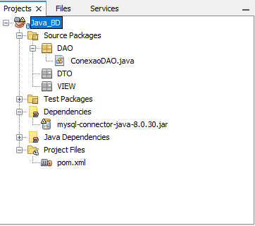

[[Journal/2023-08-29|2023-08-29]]
Ref: #ref/2023


___
# DSII-2023-08-2029

Todo o código dado em sala de aula conta no repositório do [Github](https://github.com/LucasGFBatista/ESTUDOS-SENAI/tree/master/Semestre-3/DS2/Java_BD).

## Código da aula



Cria pacotes `DAO`, `DTO`, `VIEW`

> [!info]
>
> **DAO** -> Data Access Object
>
> **DTO** -> Data transfer object
>
> **VIEW** -> *A _View_ , which is a collection of classes representing the elements in the user interface (all of the things the user can see and respond to on the screen, such as buttons, display boxes, and so forth)*

Dentro do pacote `DAO` cria a classe `ConexaoDAO.java`, código abaixo: 
```JAVA
package DAO;

import java.sql.Connection;
import java.sql.DriverManager;
import java.sql.SQLException;
import javax.swing.JOptionPane;

/**
 *
 * @author Lucas Gonçalves
 */
public class ConexaoDAO {
    public Connection conectaBd( ){
        Connection conn = null;
        
        try {
        String url = "jdbc:mysql://localhost/banco?user=root&password=";
        conn = DriverManager.getConnection(url);
        
        }catch(SQLException erro){
            JOptionPane.showMessageDialog( null, erro.getMessage());
        }
        return conn;
    }
}

```


Dentro da pasta `Project Files` tem um arquivo `pom.xml`, que deve ser inserido o seguinte codigo, entre `</packing>` e `<properties>`

> [!note]
> POM: Project Object Model

```XML
    <dependencies>
        <dependency>
            <groupId>mysql</groupId>
            <artifactId>mysql-connector-java</artifactId>
            <version>8.0.30</version>
        </dependency>
    </dependencies>
```
O que fica por completo:
```XML 
<?xml version="1.0" encoding="UTF-8"?>
<project xmlns="http://maven.apache.org/POM/4.0.0" xmlns:xsi="http://www.w3.org/2001/XMLSchema-instance" xsi:schemaLocation="http://maven.apache.org/POM/4.0.0 http://maven.apache.org/xsd/maven-4.0.0.xsd">
    <modelVersion>4.0.0</modelVersion>
    <groupId>com.mycompany</groupId>
    <artifactId>Java_BD</artifactId>
    <version>1.0-SNAPSHOT</version>
    <packaging>jar</packaging>
    
    <dependencies>
        <dependency>
            <groupId>mysql</groupId>
            <artifactId>mysql-connector-java</artifactId>
            <version>8.0.30</version>
        </dependency>
    </dependencies>
    
    <properties>
        <project.build.sourceEncoding>UTF-8</project.build.sourceEncoding>
        <maven.compiler.source>1.8</maven.compiler.source>
        <maven.compiler.target>1.8</maven.compiler.target>
    </properties>
</project>
```